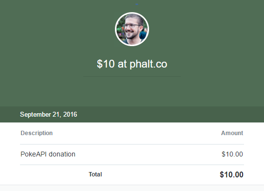

# PokedexBot
Gotta catch 'em all!

A Pokedex Bot powered by the Microsoft Bot Framework and [Pokéapi].

Prerequisites
  * Microsoft Account
  * Get started https://docs.botframework.com/en-us/node/builder/overview/#navtitle

LUIS
  https://www.luis.ai/

  Help for doing some NLP training

  - Language Understanding Intelligent Service (LUIS)
  - LUIS lets your app understand language

Go support the [Pokéapi] project, a $10 donation is all they ask for :).
  - 

[Pokéapi]: <http://www.pokeapi.co/>